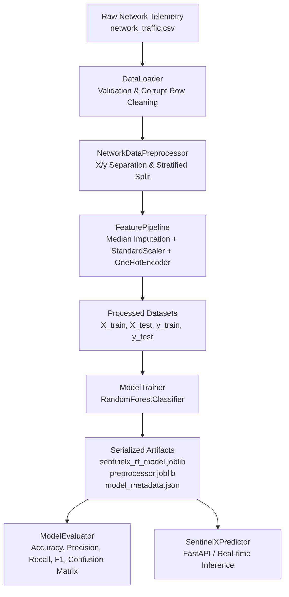

# SENTINELX — Defensive Cybersecurity ML Platform
## Phase 1: Machine Learning Foundation for Network Intrusion Detection

SENTINELX is an open, modular defensive cybersecurity platform designed to detect network intrusions, anomalies, and unauthorized lateral movements using statistical machine learning.

> [!IMPORTANT]
> **Defensive Scope & Educational Notice:**
> - SENTINELX is strictly a **defensive** cybersecurity and security analytics system. It does not implement offensive payloads, exploit engines, credential scraping, evasion techniques, or unauthorized network access.
> - **Phase 1 Status:** This codebase establishes the **machine learning foundation** (preprocessing, feature engineering, baseline Random Forest classification, metrics evaluation, and modular inference). It is a **development baseline model** and is **not claimed to be production-ready**.

---

## 1. Core Cybersecurity & Machine Learning Concepts

To bridge the gap between cybersecurity operations (SOC) and data science, here are the foundational definitions governing SENTINELX:

### What is an Intrusion Detection System (IDS)?
An **Intrusion Detection System (IDS)** is a defensive software or hardware mechanism that monitors network traffic flows or host system activities for malicious activities, policy violations, or anomalous patterns. When unauthorized activity is detected, an IDS generates alerts for Security Operations Center (SOC) analysts or triggers automated incident response workflows.

### What is a Dataset?
In defensive ML, a **Dataset** is a structured collection of historical or captured network connection records (telemetry). Each row represents a discrete network connection or packet flow (e.g., a 5-tuple TCP session), containing measured attributes and ground-truth security annotations.

### What is a Feature?
A **Feature** (input variable, denoted as $X$) is an individual measurable property or statistical characteristic of a network flow. Examples:
- `duration`: Length of the connection in seconds.
- `protocol_type`: Transport protocol (`tcp`, `udp`, `icmp`).
- `service`: Destination network application (`http`, `dns`, `ssh`, `smtp`).
- `flag`: TCP connection state (`SF` for normal establishment/termination, `S0` for SYN flood attempts with no response, `REJ` for rejected connections).
- `src_bytes` & `dst_bytes`: Payload volume transmitted across the connection.
- `count` & `srv_count`: Frequency of connections to the same host or service in a short time window.
- `same_srv_rate` & `diff_srv_rate`: Ratios describing host scanning behavior.

### What is a Label?
A **Label** (target variable, denoted as $y$) is the ground-truth classification assigned to a network flow record:
- **Binary Classification**: `0` = Normal / Benign Traffic, `1` = Intrusion / Attack.
- **Multi-class Classification**: Specific threat categories such as `normal`, `dos_syn_flood`, `port_scan`, `ssh_bruteforce`.

### What is Supervised Learning?
**Supervised Learning** is a machine learning paradigm where an algorithm learns a mapping function from input features ($X$) to known labels ($y$) using labeled historical training examples. During training, the model adjusts its internal decision thresholds to minimize classification errors.

### What is Classification?
**Classification** is the task of predicting discrete categorical classes for new, unseen inputs (e.g., deciding whether a newly observed TCP connection is "Normal" or a "DoS Attack").

### What is Training vs. Testing?
- **Training Set (80%)**: The partition of data exposed to the algorithm to learn patterns, correlations, and decision boundaries.
- **Testing Set (20%)**: A separate, held-out partition that the model **never sees** during training. It is used strictly to evaluate real-world generalization performance and prevent data leakage.
- **Stratified Splitting**: Ensures that rare attack types (which may constitute only 5-10% of total traffic) appear in the exact same proportions in both training and testing partitions.

---

## 2. Evaluation Metrics & Cybersecurity Trade-Offs

In network security, standard accuracy is notoriously misleading because benign traffic overwhelmingly outnumbers attack traffic (the **class imbalance problem**). A naive model that classifies 100% of packets as "Normal" might achieve 99% accuracy while letting severe intrusions breach the network undetected.

```
                      PREDICTED AS NORMAL            PREDICTED AS ATTACK
ACTUAL NORMAL       [ True Negative (TN) ]         [ False Positive (FP) ]
                    Normal traffic allowed.        Benign flagged -> ALERT FATIGUE

ACTUAL ATTACK       [ False Negative (FN) ]        [ True Positive (TP) ]
                    ATTACK MISSED -> BREACH!       Intrusion caught & blocked.
```

### Metrics Explained:

| Metric | Formula | Cybersecurity Meaning |
| :--- | :--- | :--- |
| **Accuracy** | $\frac{TP + TN}{TP + TN + FP + FN}$ | Overall percentage of correct predictions across all classes. |
| **Precision** | $\frac{TP}{TP + FP}$ | Of all flows flagged as attacks, how many were *actual* attacks? **High precision minimizes false alarms.** |
| **Recall** (Sensitivity) | $\frac{TP}{TP + FN}$ | Of all actual attacks occurring on the network, how many did the model detect? **High recall minimizes missed breaches.** |
| **F1 Score** | $2 \cdot \frac{\text{Precision} \cdot \text{Recall}}{\text{Precision} + \text{Recall}}$ | Harmonic mean balancing Precision and Recall into a single metric. |

### False Positives (FP) vs. False Negatives (FN) in Network Defense:

#### 1. The Cost of a False Positive (FP) — Alert Fatigue & Operational Denial
- **What it is:** The ML model misclassifies legitimate business traffic (e.g., an employee uploading a large database backup or automated API sync) as an attack.
- **Operational Impact:** Triggers false alarms in the SIEM/SOC, causes alert fatigue for security analysts, and—if configured with automated blocking—disrupts critical business operations.

#### 2. The Cost of a False Negative (FN) — Undetected Security Compromise
- **What it is:** The ML model misclassifies a genuine cyber attack (e.g., stealthy port scanning, DoS flood, or credential brute forcing) as normal traffic.
- **Operational Impact:** The attacker bypasses network perimeter defenses, establishes persistence, conducts lateral movement, or exfiltrates confidential corporate data without generating an alert.

> [!CAUTION]
> In high-security environments, **False Negatives are catastrophic** because an undetected breach can lead to full system compromise, ransomware deployment, and data loss. Therefore, security teams prioritize **High Recall** while tuning detection thresholds to keep Precision acceptable.

---

## 3. Project Architecture & File Tree

```
c:\SENTINELX\
├── ml/
│   ├── data/
│   │   ├── raw/
│   │   │   ├── .gitkeep
│   │   │   └── network_traffic.csv         # Generated synthetic / raw flow telemetry
│   │   ├── processed/
│   │   │   ├── .gitkeep
│   │   │   ├── X_train.npy                 # Scaled & encoded training feature matrix
│   │   │   ├── X_test.npy                  # Scaled & encoded testing feature matrix
│   │   │   ├── y_train.npy                 # Training ground truth labels
│   │   │   └── y_test.npy                  # Testing ground truth labels
│   │   └── external/
│   │       └── .gitkeep                    # Storage for external benchmark sets
│   ├── notebooks/
│   │   └── 01_exploratory_data_analysis.ipynb # Jupyter notebook for visual EDA
│   ├── src/
│   │   ├── __init__.py
│   │   ├── preprocessing/
│   │   │   ├── __init__.py
│   │   │   ├── data_loader.py              # CSV ingestion, validation, and cleaning
│   │   │   └── preprocessor.py             # Feature separation, encoding & splitting
│   │   ├── features/
│   │   │   ├── __init__.py
│   │   │   └── feature_pipeline.py         # ColumnTransformer with StandardScaler & OneHotEncoder
│   │   ├── training/
│   │   │   ├── __init__.py
│   │   │   └── train.py                    # Random Forest training & artifact persistence
│   │   ├── evaluation/
│   │   │   ├── __init__.py
│   │   │   └── evaluate.py                 # Classification metrics, confusion matrix & plots
│   │   └── inference/
│   │       ├── __init__.py
│   │       └── predictor.py                # Modular inference engine (FastAPI-ready)
│   ├── models/
│   │   ├── .gitkeep
│   │   ├── sentinelx_rf_model.joblib       # Serialized Random Forest classifier
│   │   ├── preprocessor.joblib             # Serialized FeaturePipeline transformer
│   │   ├── model_metadata.json             # Training parameters and schema info
│   │   ├── evaluation_metrics.json         # Evaluation metrics and classification report
│   │   └── confusion_matrix.png            # High-resolution confusion matrix heatmap
│   ├── scripts/
│   │   ├── generate_sample_data.py         # Generates controlled defensive dataset
│   │   ├── run_pipeline.py                 # End-to-end pipeline runner
│   │   ├── train_model.py                  # Standalone model training CLI
│   │   ├── evaluate_model.py               # Standalone model evaluation CLI
│   │   └── predict_sample.py               # Sample inference demonstration
│   └── requirements.txt                    # Project dependencies
└── README.md                               # Platform documentation
```

---

## 4. How Data Flows Through the ML Pipeline



1. **Ingestion (`DataLoader`)**: Reads CSV telemetry files, verifies schemas, identifies missing cells, and filters out malformed lines.
2. **Preprocessing (`NetworkDataPreprocessor`)**: Isolates target labels, performs a stratified 80/20 train-test split, and invokes the feature pipeline.
3. **Feature Transformation (`FeaturePipeline`)**: Fits median imputers and standard scalers on numerical metrics (bytes, duration, counts) and one-hot encoders on categorical attributes (`protocol_type`, `service`, `flag`). Unseen categories at inference time are handled gracefully (`handle_unknown='ignore'`).
4. **Training (`ModelTrainer`)**: Fits a balanced Random Forest ensemble on the training partition and saves serialized artifacts to `ml/models/`.
5. **Evaluation (`ModelEvaluator`)**: Computes classification performance, generates confusion matrix breakdown, and exports reports.
6. **Inference (`SentinelXPredictor`)**: Loads saved artifacts and accepts single records or batches for instant classification with confidence scores and latency telemetry.

---

## 5. Quick Start & Execution Guide

### Step 1: Virtual Environment Setup
Open PowerShell or Command Prompt in the repository root (`c:\SENTINELX`):

```powershell
# Create virtual environment
python -m venv .venv

# Activate virtual environment (Windows PowerShell)
.venv\Scripts\Activate.ps1

# Upgrade pip and install dependencies
pip install -r ml/requirements.txt
```

### Step 2: Run the End-to-End Pipeline (One Command)
To automatically generate sample network data, preprocess features, train the Random Forest classifier, evaluate test performance, and execute sample inference:

```powershell
python ml/scripts/run_pipeline.py
```

---

### Step 3: Running Individual Steps

#### 1. Generate Controlled Synthetic Telemetry
```powershell
python ml/scripts/generate_sample_data.py
```

#### 2. Train the Random Forest Model
```powershell
python ml/scripts/train_model.py --trees 100 --depth 15
```

#### 3. Evaluate Model Against Test Partition
```powershell
python ml/scripts/evaluate_model.py
```

#### 4. Run Sample Real-Time Flow Inference
```powershell
python ml/scripts/predict_sample.py
```

---

## 6. How Phase 2 Will Import the Model (FastAPI Integration Preview)

The `SentinelXPredictor` class is completely decoupled from CLI scripts and training code, making it trivial to integrate with a FastAPI router in Phase 2:

```python
from fastapi import FastAPI, HTTPException
from pydantic import BaseModel
from ml.src.inference.predictor import SentinelXPredictor

app = FastAPI(title="SENTINELX Security Analytics API", version="1.0.0")

# Initialize model predictor once during application startup
predictor = SentinelXPredictor(model_dir="ml/models")

class NetworkFlowPayload(BaseModel):
    duration: float
    protocol_type: str
    service: str
    flag: str
    src_bytes: int
    dst_bytes: int
    count: int
    srv_count: int
    same_srv_rate: float
    diff_srv_rate: float
    dst_host_count: int
    dst_host_srv_count: int
    dst_host_same_srv_rate: float
    dst_host_diff_srv_rate: float

@app.post("/api/v1/inspect-flow")
def inspect_flow(flow: NetworkFlowPayload):
    try:
        result = predictor.predict_single(flow.dict())
        return {
            "status": "success",
            "detection": result
        }
    except Exception as exc:
        raise HTTPException(status_code=400, detail=str(exc))
```

---

## 7. License & Compliance
This project is built strictly for defensive cybersecurity analysis and educational research.
# sentinelx
